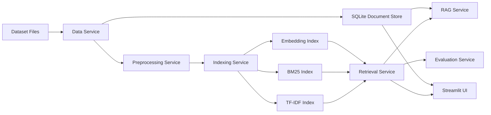

# Information Retrieval System

Python project for the 2026 Information Retrieval practical assignment.

## Dataset

The implementation uses MS MARCO Passage / TREC-DL 2019 judged data.

- Local documents: `253,947`
- Queries with qrels: `43`
- Dataset files:
  - `data/raw/msmarco/collection.tsv`
  - `data/raw/msmarco/queries.tsv`
  - `data/raw/msmarco/qrels.txt`

MS MARCO was selected because it is not Antique, contains more than 200K documents, and provides qrels for formal evaluation.

## Features

- Data preprocessing service
- SQLite document store for original document retrieval
- TF-IDF retrieval
- BM25 retrieval with configurable `k1` and `b`
- Latent semantic embedding retrieval using TF-IDF + TruncatedSVD
- Query refinement with lightweight spelling correction and synonym expansion
- BERT/Sentence-BERT reranking after BM25 candidate retrieval
- Hybrid parallel retrieval with score fusion
- Hybrid serial retrieval with BM25 candidate generation and embedding reranking
- RAG-style chat interface with grounded source passages
- Evaluation with MAP, nDCG@10, Precision@10, and Recall
- Streamlit UI

## Architecture



## Run

Install dependencies:

```powershell
python -m pip install -r requirements.txt
```

This workspace already contains local dependencies in `.codex_deps`. To use them:

```powershell
$env:PYTHONPATH=".codex_deps;src"
```

Download official MS MARCO files:

```powershell
python scripts\download_msmarco.py
```

Build the final index:

```powershell
python scripts\prepare.py --local-msmarco --max-docs 250000 --max-queries 43 --embedding-dims 128
```

Evaluate:

```powershell
python scripts\evaluate.py --local-msmarco --max-queries 43
```

Search from CLI:

```powershell
python scripts\search.py "what are symptoms of coronavirus" --method bm25 --top-k 10
```

Run UI:

```powershell
.\run_app.ps1
```

Optional BERT reranking:

```powershell
python -m pip install sentence-transformers
python scripts\search.py "what is diabetes treatment" --method bert_rerank --top-k 5
```

BERT reranking does not rebuild `search_index.joblib` or `documents.sqlite`. BM25 retrieves candidates first, then Sentence-BERT reranks only those candidates.

## Current Evaluation

The latest results are saved in `artifacts/evaluation_metrics.csv`, and the chart is saved in `reports/figures/evaluation_metrics.png`.

Best current baseline: BM25.

Additional refined-query evaluation:

- `artifacts/evaluation_metrics_refined.csv`
- `reports/figures/evaluation_metrics_refined.png`

## Team

- الخضر الديواني
- نايا سعدون
- حلا العوض
- ليث ضاهر
- نوال صالح
