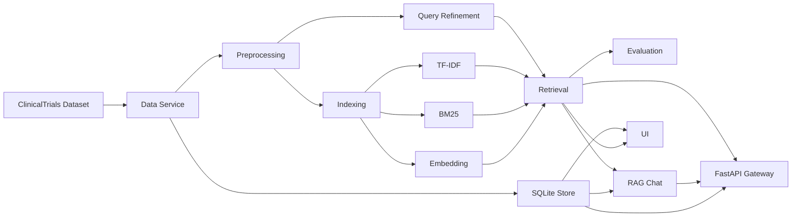
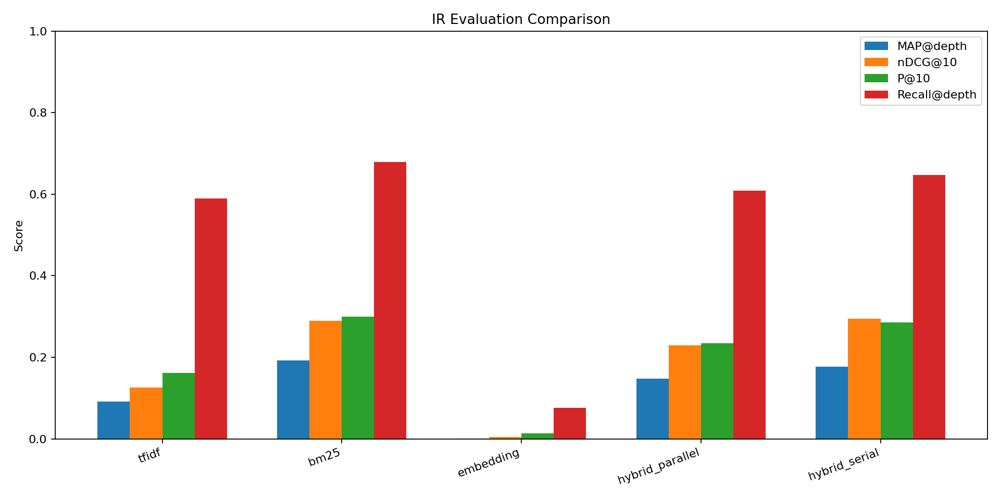

# تقرير مشروع نظم استرجاع المعلومات

## 1. فكرة المشروع

المشروع هو نظام استرجاع معلومات Information Retrieval System. يقوم المستخدم بإدخال استعلام نصي، ثم يعيد النظام أفضل الوثائق المرتبطة بالاستعلام من مجموعة بيانات كبيرة. تم تنفيذ المشروع بلغة Python، وتجهيز واجهة Streamlit، وتقييم النظام باستخدام qrels ومقاييس IR القياسية.

الهدف العملي من النظام هو محاكاة محرك بحث صغير: يأخذ query، يعالجها، يطابقها مع الوثائق، يرتب النتائج، ثم يعرض الوثائق الأصلية للمستخدم.

## 2. Dataset

تم اختيار ClinicalTrials 2017 / TREC Precision Medicine 2017 لأنها تحقق شروط المشروع:

- ليست Antique dataset.
- تحتوي على أكثر من 200K وثيقة.
- تحتوي على queries.
- تحتوي على qrels، وهذا ضروري لحساب MAP و nDCG و Precision@10 و Recall.
- يمكن استخدامها كاملة بدون تجزيء Dataset ضخمة.

تم اعتماد Dataset واحدة بناءً على التوضيح النهائي للمعيدة، لذلك بُنيت جميع النماذج والتقييمات على هذه Dataset الكاملة.

النسخة المحضرة في المشروع تحتوي على:

- عدد الوثائق: 241,006
- Dataset: `clinicaltrials/2017/trec-pm-2017`
- عدد الاستعلامات: 30
- عدد qrels: 13,019
- مصدر البيانات: `ir_datasets`

تم التدريب وبناء الفهارس على Google Colab، ثم تم حفظ الملفات الناتجة داخل مجلد `artifacts` ونقلها إلى المشروع المحلي. وقت العرض لا يتم تدريب جديد، بل يقرأ النظام الملفات الجاهزة مثل `search_index.joblib` و `documents.sqlite`.

تم استخدام Dataset كاملة بدون أخذ أول N وثيقة فقط. هذا مهم لأن ملاحظات المعيدة أكدت ضرورة اختيار Dataset قابلة للمعالجة كاملة بدلاً من أخذ عينة من Dataset ضخمة.

## 3. المعالجة المسبقة

تم تنفيذ خدمة Preprocessing مستقلة تقوم بما يلي:

- تحويل النص إلى lowercase.
- استخراج الكلمات والأرقام فقط.
- إزالة stop words الإنجليزية.
- حذف الرموز والكلمات القصيرة جداً.

نستخدم نفس المعالجة للوثائق والاستعلامات لضمان التوافق بين تمثيل query وتمثيل documents.

عند بناء TF-IDF، يتم تمرير النص المنظف مسبقاً إلى `TfidfVectorizer` مع إيقاف tokenization الافتراضي داخله:

- `tokenizer=str.split`
- `preprocessor=None`
- `token_pattern=None`
- `lowercase=False`

وبذلك لا يحدث تنظيف مزدوج داخل TF-IDF.

بالنسبة إلى ClinicalTrials، تحتوي الوثيقة على عدة حقول مثل `title`, `condition`, `summary`, `detailed_description`, `eligibility`. لذلك يتم دمج كل الحقول النصية في نص واحد للفهرسة والبحث، مع حفظ النص الأصلي الكامل في قاعدة البيانات.

## 4. Query Processing و Query Refinement

تم تنفيذ Query Processing باستخدام نفس خطوات تنظيف الوثائق، ثم تمثيل الاستعلام بالطريقة المناسبة لكل نموذج: TF-IDF أو BM25 أو Embedding.

كما تمت إضافة Query Refinement قابل للتفعيل من الواجهة. هذه الخدمة تقوم بـ:

- تصحيح بعض الأخطاء الإملائية الشائعة مثل `diabetis` إلى `diabetes`.
- توسعة الاستعلام بمرادفات بسيطة مثل:
  - `treatment` إلى `therapy`, `medication`, `medicine`
  - `symptoms` إلى `signs`, `indications`
  - `diabetes` إلى `diabetic`, `glucose`, `insulin`

ويوجد خيار في الواجهة باسم `Query refinement` لتفعيل أو إيقاف هذه الميزة وتجربتها بشكل مستقل.

## 5. بنية النظام وفق SOA

تم تقسيم المشروع إلى خدمات Python مستقلة ومنظمة وفق مفهوم SOA، مع إضافة REST API باستخدام FastAPI كـ API Gateway. تستخدم واجهة Streamlit والـ API نفس `ServiceContainer` لتحميل قاعدة البيانات والفهرس وخدمات الاسترجاع وRAG مرة واحدة، مما يقلل التكرار ويحافظ على Loose Coupling.

الخدمات الأساسية:

- Data Service: تحميل وتجهيز Dataset.
- Document Store Service: تخزين الوثائق الأصلية في SQLite.
- Preprocessing Service: تنظيف النصوص.
- Query Refinement Service: تحسين الاستعلامات.
- Indexing Service: بناء فهارس TF-IDF وBM25 وEmbedding.
- Retrieval Service: تنفيذ البحث والترتيب.
- Evaluation Service: حساب MAP وnDCG وPrecision@10 وRecall.
- RAG Service: واجهة سؤال وجواب تعتمد على الوثائق المسترجعة.
- UI Service: واجهة Streamlit.
- API Gateway: واجهة REST توفر `/health` و`/search` و`/rag` و`/metrics`.

يمكن تشغيل واختبار الخدمات بشكل مستقل:

```powershell
.\run_api.cmd
.\run_tests.cmd
```

توفر FastAPI توثيق OpenAPI تفاعلياً على:

```text
http://127.0.0.1:8000/docs
```



## 6. نماذج الاسترجاع

تم تنفيذ الطرق التالية:

- TF-IDF: تمثيل Vector Space Model وحساب cosine similarity.
- BM25: نموذج احتمالي مع إمكانية التحكم بالمعاملات k1 و b من الواجهة.
- Embedding: تمثيل latent semantic embedding باستخدام TF-IDF مع TruncatedSVD.
- Hybrid Parallel: دمج نتائج TF-IDF وBM25 وEmbedding باستخدام weighted score fusion.
- Hybrid Serial: استخدام BM25 لاسترجاع المرشحين ثم إعادة ترتيبهم باستخدام embedding.
- BERT Rerank: استخدام BM25 لجلب أفضل المرشحين بسرعة، ثم استخدام Sentence-BERT لإعادة ترتيب المرشحين دلالياً.

تم استخدام LSA / TruncatedSVD كـ embedding baseline سريع ومحلي، وتمت إضافة Sentence-BERT بطريقة reranking حتى لا نحسب BERT embeddings لكل 241,006 وثيقة. يجلب BM25 أفضل 50 مرشحاً، ثم يعيد BERT ترتيبهم دلالياً. تم تقييم BERT رسمياً، وكانت نتائجه أفضل بكثير من LSA، لذلك يمثل Sentence-BERT النموذج الدلالي الأساسي بينما بقي LSA للمقارنة العلمية.

## 7. الميزة الإضافية

لأن عدد أعضاء الفريق 5، المطلوب ميزة إضافية واحدة. تم اختيار RAG-style Chat.

تعمل الميزة بالشكل التالي:

1. يكتب المستخدم سؤالاً في تبويب RAG Chat.
2. يستخدم النظام Retrieval Service لجلب الوثائق الأكثر صلة.
3. تختار Grounded Answer Generator الجمل الأكثر ارتباطاً بكلمات السؤال من الوثائق المسترجعة.
4. يتم عرض مصادر الإجابة مع `doc_id` وscore.

الإجابة Extractive Grounded RAG تعمل محلياً دون API خارجي، وتضيف citations وتحتفظ بقائمة evidence حتى يمكن قياس groundedness.

## 8. التقييم

تم حساب المقاييس التالية:

- MAP@1000
- nDCG@10
- Precision@10
- Recall@1000

تم استرجاع أفضل 1000 وثيقة لكل query لحساب MAP وRecall بعمق عملي واضح، بينما بقيت مقاييس الرتب الأولى عند 10. النتائج محفوظة في `artifacts/evaluation_metrics.csv`:

| Method | MAP@1000 | nDCG@10 | Precision@10 | Recall@1000 |
|---|---:|---:|---:|---:|
| TF-IDF | 0.0912 | 0.1259 | 0.1621 | 0.5902 |
| BM25 | 0.1921 | 0.2892 | 0.3000 | 0.6787 |
| LSA Embedding | 0.0013 | 0.0045 | 0.0138 | 0.0763 |
| Hybrid Parallel | 0.1476 | 0.2292 | 0.2345 | 0.6086 |
| Hybrid Serial | 0.1770 | 0.2948 | 0.2862 | 0.6468 |

حسب النتائج الفعلية، حقق BM25 أفضل MAP وPrecision@10 وRecall، بينما حقق Hybrid Serial أفضل nDCG@10. لذلك نستخدم BM25 وHybrid Serial/Parallel كطرق قوية في العرض، مع إبقاء BERT rerank كخيار دلالي إضافي فوق BM25.

تم أيضاً توليد تقييم إضافي بعد تفعيل Query Refinement في `artifacts/evaluation_metrics_refined.csv`:

| Method | MAP@1000 | nDCG@10 | Precision@10 | Recall@1000 |
|---|---:|---:|---:|---:|
| TF-IDF + Refinement | 0.0910 | 0.1350 | 0.1724 | 0.5794 |
| BM25 + Refinement | 0.1766 | 0.2742 | 0.3034 | 0.6494 |
| LSA + Refinement | 0.0019 | 0.0037 | 0.0103 | 0.1237 |
| Hybrid Parallel + Refinement | 0.1430 | 0.2324 | 0.2310 | 0.6007 |
| Hybrid Serial + Refinement | 0.1640 | 0.2786 | 0.2793 | 0.6390 |

كما تم توليد الرسوم البيانية في:

- `reports/figures/evaluation_metrics.png`
- `reports/figures/evaluation_metrics_refined.png`

أظهر Query Refinement تحسناً محدوداً في TF-IDF وLSA لبعض المقاييس، لكنه خفّض MAP وRecall في BM25 والهجين. السبب أن التوسعة بمرادفات عامة قد تضيف كلمات لا تناسب المصطلحات الطبية الدقيقة. لذلك جعلناها اختيارية من الواجهة بدلاً من فرضها دائماً.

### تقييم Sentence-BERT

| Method | MAP@10 | nDCG@10 | Precision@10 | Recall@10 |
|---|---:|---:|---:|---:|
| BERT Rerank | 0.0556 | 0.2474 | 0.2655 | 0.0864 |

تفوق BERT بوضوح على LSA في الرتب العشر الأولى. وهو أبطأ من BM25، لذلك استخدمناه كمرحلة reranking فوق 50 مرشحاً بدلاً من تطبيقه على كامل الوثائق في كل query.

### التقييم قبل وبعد RAG

قبل RAG يعرض النظام الوثائق المرتبة فقط. بعد RAG يضيف إجابة مؤرضة مع evidence وcitations دون تغيير قائمة الاسترجاع الأساسية. لذلك تم تقييم جودة طبقة RAG بالمقاييس التالية:

| Source P@5 | Source Recall@5 | Query Coverage | Citation Coverage | Groundedness |
|---:|---:|---:|---:|---:|
| 0.2483 | 0.0604 | 0.4352 | 0.6000 | 1.0000 |

قيمة Groundedness الكاملة تعني أن كل جملة دليل في الإجابة موجودة نصياً في الوثائق الأصلية المسترجعة من SQLite. Citation Coverage تساوي 0.6 لأن الإجابة تعرض أفضل ثلاثة أدلة من أصل خمسة مصادر مسترجعة.

## 9. لقطات من النظام

### Search Results


### RAG Answer


### RAG Sources


### Evaluation Chart



## 10. الواجهة

تم بناء واجهة Streamlit تحتوي على:

- اختيار طريقة البحث.
- التحكم بمعاملات BM25.
- تفعيل أو إيقاف Query Refinement.
- اختيار BERT reranking من قائمة طرق البحث عند توفر النموذج.
- عرض أفضل 10 وثائق أصلية من SQLite.
- تبويب RAG Chat.
- تبويب Evaluation لعرض النتائج والرسم البياني.

## 11. تقسيم العمل بين أعضاء الفريق

- الخضر الديواني: تجهيز Dataset، إدارة qrels، وتحضير ملفات التدريب على Colab.
- نايا سعدون: Preprocessing و Query Processing و Query Refinement.
- حلا العوض: TF-IDF و Embedding وتمثيل الوثائق.
- ليث ضاهر: BM25 و Hybrid Retrieval و Ranking.
- نوال صالح: Evaluation و Streamlit UI و RAG Chat وكتابة التقرير.

## 12. طريقة التشغيل

وقت العرض لا نعيد التدريب. نشغل الواجهة فقط:

```powershell
cd "C:\Users\Lenovo\Desktop\ir dociment\ir_project"
.\run_app.cmd
```

ثم نفتح:

```text
http://localhost:8501
```

إذا أردنا إعادة بناء الفهارس من الصفر:

```powershell
$env:PYTHONPATH=".codex_deps;src"
python scripts\prepare.py --dataset clinicaltrials/2017/trec-pm-2017 --max-docs 0 --max-queries 0 --embedding-dims 64 --max-features 30000 --min-df 2 --max-df 0.95
python scripts\evaluate.py --dataset clinicaltrials/2017/trec-pm-2017 --max-queries 0
python scripts\evaluate_bert.py
python scripts\evaluate_rag.py
```

## 13. GitHub

تم تجهيز المشروع للرفع على GitHub مع تجاهل الملفات الضخمة مثل:

- `data/raw/`
- `artifacts/search_index.joblib`
- `artifacts/documents.sqlite`
- `artifacts/bert_model_cache`
- `.codex_deps`

الـ README يشرح طريقة تنزيل Dataset وتوليد الملفات الكبيرة محلياً أو على Colab.

## 14. المصادر

1. IR Datasets documentation: https://ir-datasets.com/
2. TREC Precision Medicine Track: https://trec.nist.gov/data/precmed.html
3. scikit-learn TF-IDF documentation: https://scikit-learn.org/stable/modules/generated/sklearn.feature_extraction.text.TfidfVectorizer.html
4. scikit-learn TruncatedSVD documentation: https://scikit-learn.org/stable/modules/generated/sklearn.decomposition.TruncatedSVD.html
5. Reimers, N. and Gurevych, I. Sentence-BERT: https://arxiv.org/abs/1908.10084
6. Sentence Transformers documentation: https://www.sbert.net/
7. FastAPI documentation: https://fastapi.tiangolo.com/
8. Robertson, S. and Zaragoza, H. The Probabilistic Relevance Framework: BM25 and Beyond. Foundations and Trends in Information Retrieval, 2009.
