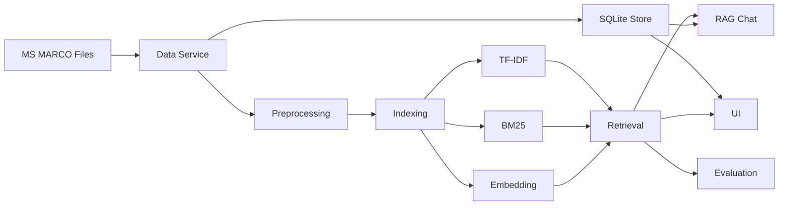

# تقرير مشروع نظم استرجاع المعلومات

## 1. فكرة المشروع

المشروع عبارة عن نظام استرجاع معلومات Information Retrieval System. يقوم المستخدم بإدخال استعلام نصي، ثم يعيد النظام أفضل 10 وثائق مرتبطة بالاستعلام من مجموعة بيانات كبيرة. تم تنفيذ المشروع بلغة Python مع واجهة بسيطة وتجهيز تقييم رسمي باستخدام qrels.

## 2. Dataset

تم اختيار MS MARCO Passage / TREC-DL 2019 judged لأنها تحقق شروط المشروع:

- ليست Antique dataset.
- تحتوي على أكثر من 200K وثيقة.
- تحتوي على queries.
- تحتوي على qrels، وهذا ضروري لحساب MAP و nDCG.

النسخة المحضرة في المشروع تحتوي على:

- عدد الوثائق: 253,947
- عدد الاستعلامات ذات qrels: 43
- مصدر الوثائق المحلي: `data/raw/msmarco/collection.tsv`
- مصدر الاستعلامات: `data/raw/msmarco/queries.tsv`
- مصدر qrels: `data/raw/msmarco/qrels.txt`

## 3. المعالجة المسبقة

تم تنفيذ خدمة Preprocessing مستقلة تقوم بما يلي:

- تحويل النص إلى lowercase.
- استخراج الكلمات والأرقام فقط.
- إزالة stop words الإنجليزية.
- حذف الرموز والكلمات القصيرة جداً.

نستخدم نفس المعالجة للوثائق والاستعلامات لضمان التوافق بين تمثيل query وتمثيل documents.

## 4. بنية النظام وفق SOA

تم تقسيم المشروع إلى خدمات مستقلة:

- Data Service: تحميل وتجهيز Dataset.
- Document Store Service: تخزين الوثائق الأصلية في SQLite.
- Preprocessing Service: تنظيف النصوص.
- Indexing Service: بناء فهارس TF-IDF وBM25 وEmbedding.
- Retrieval Service: تنفيذ البحث والترتيب.
- Evaluation Service: حساب MAP وnDCG وPrecision@10 وRecall.
- RAG Service: واجهة سؤال وجواب تعتمد على الوثائق المسترجعة.
- UI Service: واجهة Streamlit.



## 5. نماذج الاسترجاع

تم تنفيذ الطرق التالية:

- TF-IDF: تمثيل Vector Space Model وحساب cosine similarity.
- BM25: نموذج احتمالي مع إمكانية التحكم بالمعاملات k1 و b.
- Embedding: تمثيل latent semantic embedding باستخدام TF-IDF مع TruncatedSVD.
- Hybrid Parallel: دمج نتائج TF-IDF وBM25 وEmbedding باستخدام weighted score fusion.
- Hybrid Serial: استخدام BM25 لاسترجاع المرشحين ثم إعادة ترتيبهم باستخدام embedding.

## 6. الميزة الإضافية

لأن عدد أعضاء الفريق 5، المطلوب ميزة إضافية واحدة. تم اختيار RAG-style chat.

الواجهة تسمح بكتابة سؤال، ثم يسترجع النظام الوثائق الأكثر صلة، ويعرض إجابة extractive مبنية على النصوص المسترجعة مع مصادرها. هذه الميزة قابلة للتجربة بشكل مستقل من تبويب RAG Chat في الواجهة.

## 7. التقييم

تم حساب المقاييس التالية:

- MAP
- nDCG@10
- Precision@10
- Recall

نتائج التقييم الحالية:

| Method | MAP | nDCG@10 | Precision@10 | Recall |
|---|---:|---:|---:|---:|
| TF-IDF | 0.1587 | 0.4781 | 0.8047 | 0.1688 |
| BM25 | 0.2007 | 0.5609 | 0.9023 | 0.2028 |
| Embedding | 0.0137 | 0.0861 | 0.1767 | 0.0182 |
| Hybrid Parallel | 0.1816 | 0.5434 | 0.8698 | 0.1881 |
| Hybrid Serial | 0.1800 | 0.5405 | 0.8419 | 0.1862 |

أفضل نموذج في هذه التجربة هو BM25، ويظهر ذلك خصوصاً في Precision@10 وMAP. نتائج Embedding وحده أقل لأن تمثيل LSA المستخدم خفيف وسريع ومبني على corpus محلي، بينما BM25 مناسب جداً لطبيعة MS MARCO passage retrieval.

الرسم البياني موجود في:

`reports/figures/evaluation_metrics.png`

## 8. الواجهة

تم بناء واجهة Streamlit تحتوي على:

- اختيار طريقة البحث.
- التحكم بمعاملات BM25.
- عرض أفضل 10 وثائق أصلية من SQLite.
- تبويب RAG Chat.
- تبويب Evaluation لعرض النتائج والرسم البياني.

## 9. تقسيم العمل بين خمسة أعضاء

- العضو الأول: Dataset وتجهيز qrels والوثائق.
- العضو الثاني: Preprocessing وTF-IDF.
- العضو الثالث: BM25 وHybrid Retrieval.
- العضو الرابع: Evaluation والرسوم البيانية.
- العضو الخامس: UI وRAG Chat وREADME.

## 10. طريقة التشغيل

```powershell
$env:PYTHONPATH=".codex_deps;src"
python scripts\prepare.py --local-msmarco --max-docs 250000 --max-queries 43 --embedding-dims 128
python scripts\evaluate.py --local-msmarco --max-queries 43
.\run_app.ps1
```
