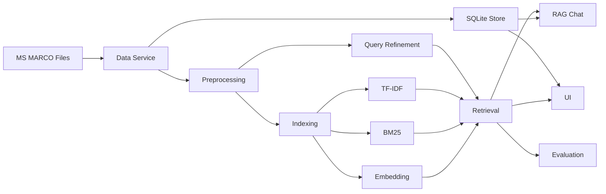
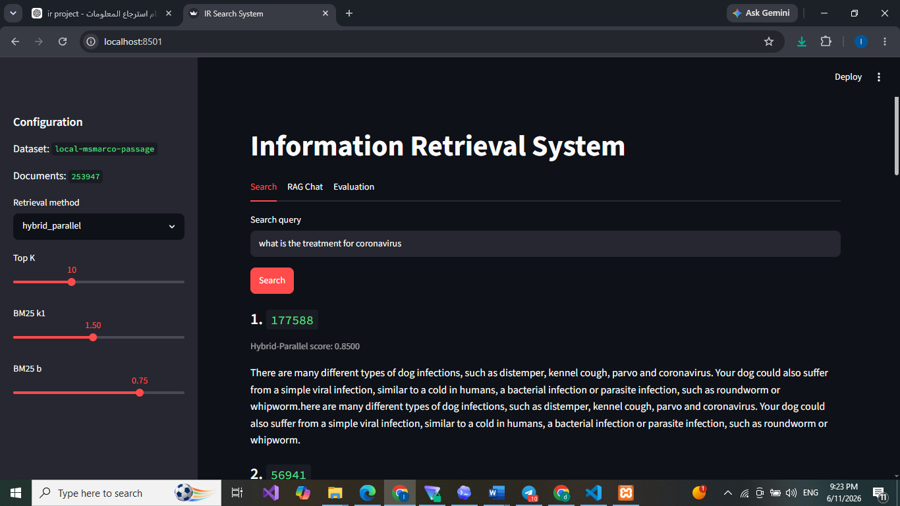
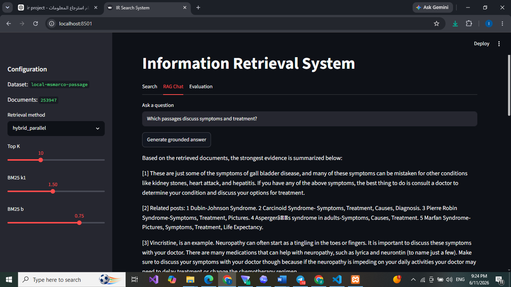
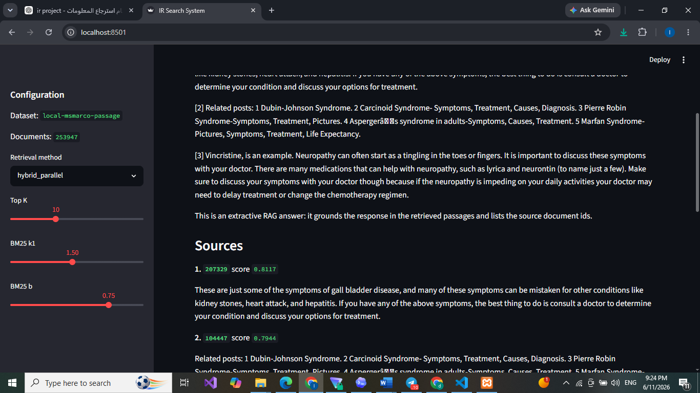
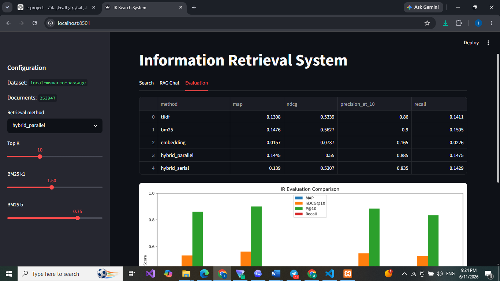
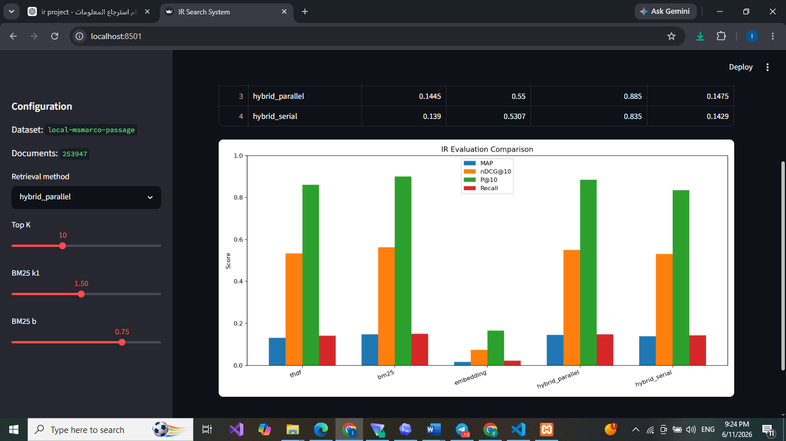

# تقرير مشروع نظم استرجاع المعلومات

## 1. فكرة المشروع

المشروع هو نظام استرجاع معلومات Information Retrieval System. يقوم المستخدم بإدخال استعلام نصي، ثم يعيد النظام أفضل الوثائق المرتبطة بالاستعلام من مجموعة بيانات كبيرة. تم تنفيذ المشروع بلغة Python، وتجهيز واجهة Streamlit، وتقييم النظام باستخدام qrels ومقاييس IR القياسية.

الهدف العملي من النظام هو محاكاة محرك بحث صغير: يأخذ query، يعالجها، يطابقها مع الوثائق، يرتب النتائج، ثم يعرض الوثائق الأصلية للمستخدم.

## 2. Dataset

تم اختيار MS MARCO Passage / TREC-DL 2019 judged لأنها تحقق شروط المشروع:

- ليست Antique dataset.
- تحتوي على أكثر من 200K وثيقة.
- تحتوي على queries.
- تحتوي على qrels، وهذا ضروري لحساب MAP و nDCG و Precision@10 و Recall.

النسخة المحضرة في المشروع تحتوي على:

- عدد الوثائق: 253,947
- Dataset: `local-msmarco-passage`
- مصدر الوثائق المحلي: `data/raw/msmarco/collection.tsv`
- مصدر الاستعلامات: `data/raw/msmarco/queries.tsv`
- مصدر qrels: `data/raw/msmarco/qrels.txt`

تم التدريب وبناء الفهارس على Google Colab، ثم تم حفظ الملفات الناتجة داخل مجلد `artifacts` ونقلها إلى المشروع المحلي. وقت العرض لا يتم تدريب جديد، بل يقرأ النظام الملفات الجاهزة مثل `search_index.joblib` و `documents.sqlite`.

## 3. المعالجة المسبقة

تم تنفيذ خدمة Preprocessing مستقلة تقوم بما يلي:

- تحويل النص إلى lowercase.
- استخراج الكلمات والأرقام فقط.
- إزالة stop words الإنجليزية.
- حذف الرموز والكلمات القصيرة جداً.

نستخدم نفس المعالجة للوثائق والاستعلامات لضمان التوافق بين تمثيل query وتمثيل documents.

## 4. Query Processing و Query Refinement

تم تنفيذ Query Processing باستخدام نفس خطوات تنظيف الوثائق، ثم تمثيل الاستعلام بالطريقة المناسبة لكل نموذج: TF-IDF أو BM25 أو Embedding.

كما تمت إضافة Query Refinement قابل للتفعيل من الواجهة. هذه الخدمة تقوم بـ:

- تصحيح بعض الأخطاء الإملائية الشائعة مثل `diabetis` إلى `diabetes`.
- توسعة الاستعلام بمرادفات بسيطة مثل:
  - `treatment` إلى `therapy`, `medication`, `medicine`
  - `symptoms` إلى `signs`, `indications`
  - `diabetes` إلى `diabetic`, `glucose`, `insulin`

ويوجد خيار في الواجهة باسم `Query refinement` لتفعيل أو إيقاف هذه الميزة وتجربتها بشكل مستقل.

## 5. بنية النظام وفق SOA

تم تقسيم المشروع إلى خدمات Python مستقلة ومنظمة وفق مفهوم SOA. لم يتم استخدام Microservices أو REST API حقيقية لتقليل التعقيد وضمان سرعة العرض، لكن تم تحقيق فصل واضح للمسؤوليات وقابلية تشغيل الخدمات بشكل مستقل من خلال سكربتات Python.

الخدمات الأساسية:

- Data Service: تحميل وتجهيز Dataset.
- Document Store Service: تخزين الوثائق الأصلية في SQLite.
- Preprocessing Service: تنظيف النصوص.
- Query Refinement Service: تحسين الاستعلامات.
- Indexing Service: بناء فهارس TF-IDF وBM25 وEmbedding.
- Retrieval Service: تنفيذ البحث والترتيب.
- Evaluation Service: حساب MAP وnDCG وPrecision@10 وRecall.
- RAG Service: واجهة سؤال وجواب تعتمد على الوثائق المسترجعة.
- UI Service: واجهة Streamlit.



## 6. نماذج الاسترجاع

تم تنفيذ الطرق التالية:

- TF-IDF: تمثيل Vector Space Model وحساب cosine similarity.
- BM25: نموذج احتمالي مع إمكانية التحكم بالمعاملات k1 و b من الواجهة.
- Embedding: تمثيل latent semantic embedding باستخدام TF-IDF مع TruncatedSVD.
- Hybrid Parallel: دمج نتائج TF-IDF وBM25 وEmbedding باستخدام weighted score fusion.
- Hybrid Serial: استخدام BM25 لاسترجاع المرشحين ثم إعادة ترتيبهم باستخدام embedding.
- BERT Rerank: استخدام BM25 لجلب أفضل المرشحين بسرعة، ثم استخدام Sentence-BERT لإعادة ترتيب المرشحين دلالياً.

تم استخدام LSA / TruncatedSVD كتمثيل Embedding سريع ومحلي، وتمت إضافة BERT بطريقة reranking حتى لا نحسب BERT embeddings لكل 253,947 وثيقة. هذه الطريقة عملية لأن BM25 يجلب عدداً صغيراً من المرشحين، ثم BERT يعيد ترتيبهم دلالياً. لا نحتاج إعادة تدريب الفهارس لاستخدام BERT، وإنما نحتاج فقط تحميل نموذج `sentence-transformers/all-MiniLM-L6-v2`.

## 7. الميزة الإضافية

لأن عدد أعضاء الفريق 5، المطلوب ميزة إضافية واحدة. تم اختيار RAG-style Chat.

تعمل الميزة بالشكل التالي:

1. يكتب المستخدم سؤالاً في تبويب RAG Chat.
2. يستخدم النظام Retrieval Service لجلب الوثائق الأكثر صلة.
3. يتم بناء جواب extractive grounded answer من المقاطع المسترجعة.
4. يتم عرض مصادر الإجابة مع `doc_id` وscore.

الميزة قابلة للتجربة بشكل مستقل من تبويب RAG Chat.

## 8. التقييم

تم حساب المقاييس التالية:

- MAP
- nDCG@10
- Precision@10
- Recall

نتائج التقييم الظاهرة في الواجهة بعد تدريب Colab:

| Method | MAP | nDCG@10 | Precision@10 | Recall |
|---|---:|---:|---:|---:|
| TF-IDF | 0.1308 | 0.5339 | 0.8600 | 0.1411 |
| BM25 | 0.1476 | 0.5627 | 0.9000 | 0.1505 |
| Embedding | 0.0157 | 0.0737 | 0.1650 | 0.0226 |
| Hybrid Parallel | 0.1445 | 0.5500 | 0.8850 | 0.1475 |
| Hybrid Serial | 0.1390 | 0.5307 | 0.8350 | 0.1429 |

أفضل نموذج في هذه التجربة هو BM25، خصوصاً في Precision@10 و nDCG@10. هذا منطقي لأن MS MARCO Passage يعتمد كثيراً على مطابقة المصطلحات، وBM25 مناسب جداً لهذا النوع من البيانات.

تم أيضاً توليد تقييم إضافي بعد تفعيل Query Refinement في:

- `artifacts/evaluation_metrics_refined.csv`
- `reports/figures/evaluation_metrics_refined.png`

بالنسبة إلى RAG، فهو لا يغيّر qrels مباشرة لأنه طبقة إجابة فوق الاسترجاع، لذلك تم تقييم نماذج الاسترجاع الأساسية رقمياً، وتم تقييم RAG عملياً من خلال الواجهة وعرض المصادر.

ملاحظة حول BERT: تم إضافته كخيار في الواجهة باسم `bert_rerank`. هذا الخيار مناسب للعرض العملي عند توفر مكتبة `sentence-transformers` ونموذج BERT محلياً. لم يتم إدخاله في جدول التقييم الأساسي لأنه أبطأ ويعمل كمرحلة reranking فوق BM25 وليس فهرساً مستقلاً لكل الوثائق.

## 9. لقطات من النظام

### Search Results



### RAG Answer



### RAG Sources



### Evaluation Table



### Evaluation Chart



## 10. الواجهة

تم بناء واجهة Streamlit تحتوي على:

- اختيار طريقة البحث.
- التحكم بمعاملات BM25.
- تفعيل أو إيقاف Query Refinement.
- اختيار BERT reranking من قائمة طرق البحث عند توفر النموذج.
- عرض أفضل 10 وثائق أصلية من SQLite.
- تبويب RAG Chat.
- تبويب Evaluation لعرض النتائج والرسم البياني.

## 11. تقسيم العمل بين أعضاء الفريق

- الخضر الديواني: تجهيز Dataset، إدارة qrels، وتحضير ملفات التدريب على Colab.
- نايا سعدون: Preprocessing و Query Processing و Query Refinement.
- حلا العوض: TF-IDF و Embedding وتمثيل الوثائق.
- ليث ضاهر: BM25 و Hybrid Retrieval و Ranking.
- نوال صالح: Evaluation و Streamlit UI و RAG Chat وكتابة التقرير.

## 12. طريقة التشغيل

وقت العرض لا نعيد التدريب. نشغل الواجهة فقط:

```powershell
cd "C:\Users\Lenovo\Desktop\ir dociment\ir_project"
.\run_app.ps1
```

ثم نفتح:

```text
http://localhost:8501
```

إذا أردنا إعادة بناء الفهارس من الصفر:

```powershell
$env:PYTHONPATH=".codex_deps;src"
python scripts\prepare.py --local-msmarco --max-docs 250000 --max-queries 43 --embedding-dims 128
python scripts\evaluate.py --local-msmarco --max-queries 43
```

## 13. GitHub

تم تجهيز المشروع للرفع على GitHub مع تجاهل الملفات الضخمة مثل:

- `data/raw/msmarco/collection.tsv`
- `artifacts/search_index.joblib`
- `artifacts/documents.sqlite`
- `.codex_deps`

الـ README يشرح طريقة تنزيل Dataset وتوليد الملفات الكبيرة محلياً أو على Colab.
